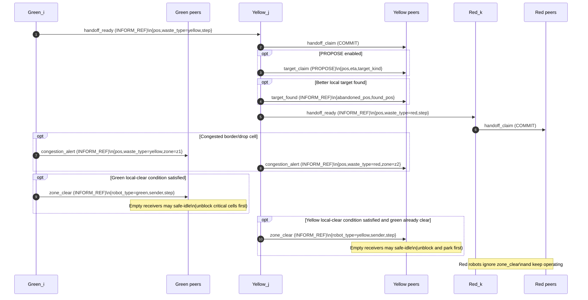
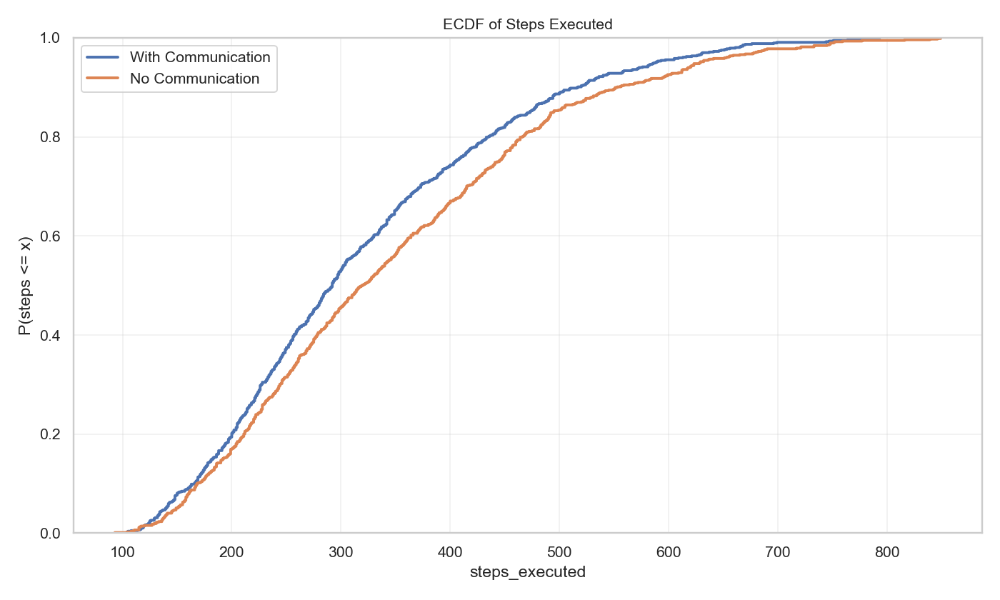
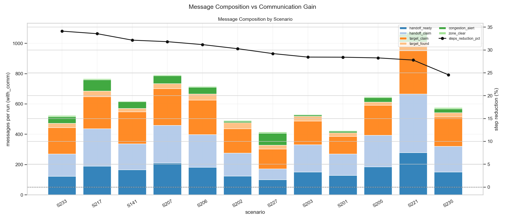
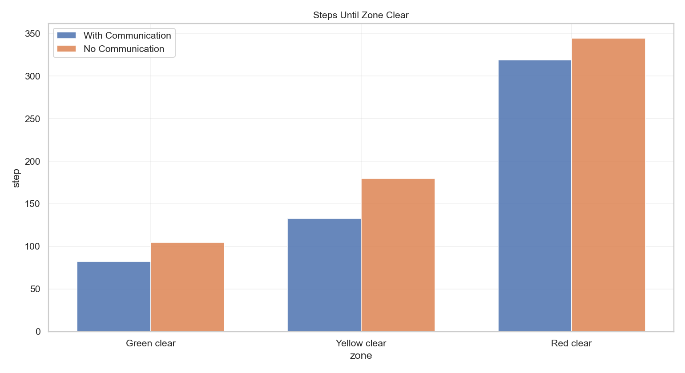
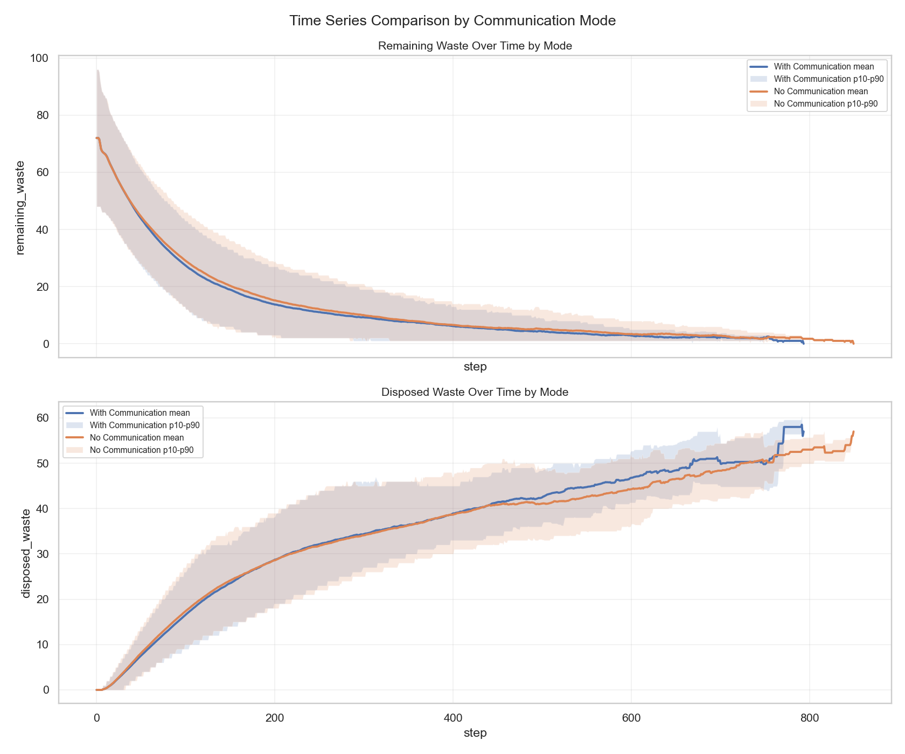

# Self-organization of robots in a hostile environment

- **Group number:** 22
- **Members:**
  - Gabriel Anjos Moura
  - Vinícius da Mata e Mota
  - Nicholas Estevão Pereira de Oliveira Rodrigues Bragança

In this README, we present the robot behavior and communication strategies used for nuclear waste collection. We also ran benchmarks to compare performance with and without inter-robot communication. For results and analysis, see [Benchmark Results, Discussion, and Conclusion](#benchmark-results-discussion-and-conclusion).

## Table of Contents

- [Project Structure](#project-structure)
- [Environment](#environment)
- [Robot Strategy](#robot-strategy)
- [Agent Communication Protocol](#agent-communication-protocol)
- [How to Run](#how-to-run)
- [Benchmark Results, Discussion, and Conclusion](#benchmark-results-discussion-and-conclusion)

---

## Project Structure

| File | Description |
|---|---|
| `actions.py` | Catalog of action factories returned by `deliberate` (`move`, `pick`, `transform`, `transform_orphan`, `drop`, `dispose`, `idle`). |
| `agents.py` | Green, yellow, and red robot classes implementing the perception → deliberation → action cycle. |
| `objects.py` | Passive environment objects: `Waste`, `RadioactivityCell`, `WasteDisposalZone`. |
| `model.py` | Mesa model: environment initialization, action execution (`do`), and `DataCollector`. |
| `server.py` | Solara visualization server. |
| `run.py` | Quick headless execution in script mode. |
| `config.py` | Default parameters and visual constants. |
| `communication/` | Communication package. |

---

## Environment

The grid (default **15 × 10**) is divided into three vertical zones of equal width:

| Zone | Columns | Radioactivity | Robots allowed |
|---|---|---|---|
| `z1` (green) | 0 – 4 | 0.00 – 0.33 | Green, Yellow, Red |
| `z2` (yellow) | 5 – 9 | 0.33 – 0.66 | Yellow, Red |
| `z3` (red) | 10 – 14 | 0.66 – 1.00 | Red only |

A single **Waste Disposal Zone** is placed at a random row on the rightmost column.

---

## Robot Strategy

All robots share the same **perception → deliberation → action** loop defined in `BaseRobotAgent.step_agent()`. Each step, a robot:
1. Receives **percepts** from the model (visible tiles, waste positions, allowed moves).
2. Updates its **knowledge** dictionary (includes a 25-step positional history and a persistent memory map of seen tiles).
3. Runs **`deliberate(knowledge)`** to choose an action.
4. Sends the action to the model via **`do()`** and stores the returned percepts.

### Perception and movement model

- **Limited field of view:** the robot only perceives its own cell + immediate neighbourhood (`Moore`, radius 1), filtered by allowed zones.
- **Local motion:** each move is to one neighbouring cell only (including diagonals), always avoiding occupied robot cells.
- **Target following:** movement towards a target uses Manhattan-distance minimization over free neighbouring cells.
- **Memory use:** although perception is local, robots keep a persistent map (`knowledge["memory"]`) of previously seen tiles/waste.

### Zig-zag patrol

When no actionable waste target is available, robots patrol using a precomputed `patrol_path`:
- Built once per robot from allowed zone boundaries.
- X waypoints advance with stride 3 (`min_x + 1, min_x + 4, ...`) and may append `max_x - 1`.
- For each waypoint column, Y alternates between top and bottom (`0 ↔ ymax`), creating a **zig-zag vertical sweep**.
- The path is rotated so each robot starts from the closest waypoint to its initial position.

---

### 🟢 Green Robot — `GreenRobotAgent`

**Zone:** `z1` only | **Collects:** green waste | **Produces:** yellow waste | **Capacity:** 2

#### Decision flow

1. If carrying a **yellow** item, deliver to nearest `z1` east target and `drop`.
2. If carrying one **green** and no reachable green target remains, execute `transform_orphan` (green → yellow).
3. If carrying 2 greens, execute `transform` (2 green → 1 yellow).
4. If standing on green waste and has capacity, `pick`.
5. Otherwise, move to nearest known green target.
6. If no target exists, follow zig-zag patrol (`goal_type="patrol"`).
7. Extra handoff behavior: after dropping yellow on `z1` east border and becoming empty, retreat west/random free move to avoid blocking yellow robots.

---

### 🟡 Yellow Robot — `YellowRobotAgent`

**Zones:** `z1` and `z2` | **Collects:** yellow waste | **Produces:** red waste | **Capacity:** 2

#### Decision flow

1. If carrying a **red** item, deliver to nearest `z2` east target and `drop`.
2. If carrying one **yellow** and no yellow target remains, execute `transform_orphan` (yellow → red).
3. If carrying 2 yellows, execute `transform` (2 yellow → 1 red).
4. If standing on yellow waste and has capacity, `pick`.
5. Otherwise, move to nearest known yellow target.
6. If no target exists, follow zig-zag patrol (`goal_type="patrol"`).

Yellow robots can enter `z1` to collect yellow waste produced by green robots at the `z1`/`z2` handoff.

---

### 🔴 Red Robot — `RedRobotAgent`

**Zones:** `z1`, `z2`, `z3` (all zones) | **Collects:** red waste | **No transformation** | **Capacity:** 1

#### Decision flow

1. If carrying one red item:
   - at disposal zone: `dispose`;
   - otherwise: move toward disposal position.
2. If on a red waste cell and empty, `pick`.
3. Else move to nearest known red target.
4. If no target exists, use zig-zag patrol (not random walk).

---

## Orphan Waste Handling

When the total quantity of waste of a given type is **odd**, one unit will be left without a pair and can never be transformed through the standard 2-into-1 rule. We handle this via **forced promotion** (`transform_orphan`).

### Detection

At every step, each robot distinguishes:
- **Normal waste** — `visible_waste_positions[type]`: waste items not flagged as orphan.
- **Orphan waste** — `orphan_waste_positions[type]`: waste items flagged as orphan (dropped by a previous generation of robots).

A robot decides it can handle orphan waste (`can_pick_orphans = True`) when:
- It is **already carrying 1 item** and wants to pair it, **or**
- There are **no non-orphan items left** of that type anywhere in the accessible zones — meaning no pair will ever form.

### Resolution

When a robot is carrying **exactly 1 item** of its collectible type and `target_greens` / `target_yellows` is empty (no more waste to collect), instead of dropping the lone item on the grid (where no downstream robot could handle it), it calls `transform_orphan()`:

| Situation | Action | Result |
|---|---|---|
| Green robot holds 1 green, no more greens | `transform_orphan()` | cargo becomes **yellow** |
| Yellow robot holds 1 yellow, no more yellows | `transform_orphan()` | cargo becomes **red** |

The robot then proceeds with its normal delivery step: it carries the promoted item to the east border and drops it, where the next tier of robots picks it up as a regular item.

This ensures the full pipeline never stalls: every waste unit, whether paired or not, eventually reaches the disposal zone.

### Why not `drop(orphan=True)`?

An earlier design dropped the lone item at the zone border with an `orphan` flag. This was broken because the downstream robot (e.g. yellow) only collects its own type (yellow) — a green orphan dropped at the border would sit there forever. `transform_orphan` avoids this by promoting the item in-cargo before delivery.

---

## Agent Communication Protocol

Robots communicate through the `communication/` package (`Message`, `Mailbox`, `MessageService`, `MessagePerformative`).

### Transport model

- The mission uses `instant_delivery=False`.
- At each tick, `model.step()` first calls `message_service.dispatch_messages()`, then agents execute their actions.
- Practical effect: messages sent in step `t` are consumed in step `t+1`.

### Performatives used

| Performative | Role in this project |
|---|---|
| `PROPOSE` | Non-binding target reservation announcements (`target_claim`) |
| `COMMIT` | Binding handoff reservation (`handoff_claim`) |
| `INFORM_REF` | Event notifications (`handoff_ready`, `target_found`, `congestion_alert`, `zone_clear`) |

Notes:
- Solara exposes `Enable PROPOSE messages` so you can disable only `PROPOSE` traffic in a run while keeping `COMMIT` and `INFORM_REF`.
- `target_claim` is rate-limited by intent: it is sent once per target and only when ETA is not short (`eta >= 3`), reducing redundant chatter.

### Message types

| `kind` | Performative | Sender -> Receivers | Intent | Typical payload |
|---|---|---|---|---|
| `handoff_ready` | `INFORM_REF` | Green -> all Yellow, Yellow -> all Red | Announces new transformed waste dropped on handoff border | `pos`, `waste_type`, `robot_type`, `step` |
| `handoff_claim` | `COMMIT` | Claimer -> peers of same color | Commits pickup responsibility for a handoff target | `pos`, `eta`, `claimer`, `handoff_sender`, `waste_type`, `step` |
| `target_claim` | `PROPOSE` | Robot -> peers of same color | Announces current target and ETA to reduce duplicate pursuit | `pos`, `eta`, `claimer`, `target_kind`, `waste_type`, `step` |
| `target_found` | `INFORM_REF` | Robot -> peers of same color | Announces abandonment of previous target/handoff after finding a better local pick | `abandoned_pos`, `found_pos`, `finder`, `handoff_sender`, `waste_type`, `step` |
| `congestion_alert` | `INFORM_REF` | Border producer -> peers of same color | Announces blocked border/drop cell to avoid repeated drops on the same cell | `pos`, `waste_type`, `zone`, `sender`, `step` |
| `zone_clear` | `INFORM_REF` | First Green/Yellow robot satisfying local-clear conditions -> peers of same color | Announces that the color-specific workload is clear. Message is emitted at most once per color/run (`model.zone_clear_announced[color]`). Receivers only idle when empty and in safe (non-blocking) cells (`red` ignores zone-clear idling; yellow can announce/accept only after green clear is already recorded). | `robot_type`, `sender`, `step` |

### Interaction protocol (Mermaid)



---

## Visualization of Trajectories and Goals

In `server.py`, `GridZones` renders extra robot-intent overlays from each robot's knowledge:
- **Waste memory links:** dotted line from robot to remembered waste targets (including orphans of its own collectible type).
- **Planned objective trajectory:** solid magenta line from robot to `current_goal` when goal type is an objective.
- **Patrol trajectory:** dashed blue line from robot to `current_goal` when goal type is patrol.

The sidebar has per-type toggles:
- `Green Trajectories`
- `Yellow Trajectories`
- `Red Trajectories`

---

## How to Run

### Headless simulation

You can run a single custom scenario directly from CLI:

```bash
python run.py \
  --width 30 --height 20 \
  --n-green-robots 8 --n-yellow-robots 6 --n-red-robots 4 \
  --initial-green-waste 80 --initial-yellow-waste 40 --initial-red-waste 20 \
  --max-steps 1200 \
  --seed 42
```

Disable all communication messages in single-run mode:

```bash
python run.py --disable-communication
```

### Interactive visualization (Solara)

```bash
solara run server.py
```

### Benchmark sweep (without Solara server)

`run.py` supports combinatorial benchmarks with repetitions and automatically runs each scenario in **two modes**:
- `with_comm` (full communication enabled)
- `no_comm` (all messages disabled)

```bash
python run.py --benchmark \
  --widths 15,30 \
  --heights 10,20 \
  --green-robots 4,8 \
  --yellow-robots 3,6 \
  --red-robots 2,4 \
  --green-waste 24,48 \
  --yellow-waste 12,24 \
  --red-waste 12,24 \
  --max-steps-grid 1800 \
  --repetitions 3 \
  --seed-base 1000 \
  --output-dir benchmark_results
```

This command runs all parameter combinations (`Cartesian product`) and stores:
- `benchmark_metadata.json` — benchmark setup (grid values, repetitions, seeds, total planned runs).
- `benchmark_runs.csv` — one row per run with final metrics, communication mode, message counts, and zone-clear steps.
- `benchmark_scenarios.csv` — aggregated per-scenario/per-mode metrics (mean/std/min/max).
- `benchmark_timeseries.csv` — per-step metrics from `DataCollector` (unless `--skip-timeseries` is used).

Main optimization targets available in CSV output:
- `steps_executed`
- `final_remaining_waste`
- `final_efficiency`
- `final_total_distance`
- `completion_rate` (scenario-level)

### Plot benchmark results

After the benchmark, generate plots with:

```bash
python plot_benchmark.py --input-dir benchmark_results
```

Optional flags:
- `--output-dir benchmark_results/plots_custom`
- `--skip-timeseries` (faster when `benchmark_timeseries.csv` is very large)
- `--top-scenario-labels 20`

Generated images (PNG):
- `run_level_distributions.png`
- `run_distributions.png` 
- `runtime_distribution.png`
- `parameter_impact_completion.png`
- `impact_completion_rate.png`
- `parameter_impact_steps.png`
- `parameter_impact_efficiency.png`
- `impact_efficiency.png` 
- `parameter_impact_remaining_waste.png`
- `impact_remaining_waste.png` 
- `proportion_successful_collection.png`
- `scenario_frontier.png`
- `timeseries_summary.png` (unless `--skip-timeseries`)
- `communication_mode_comparison.png`
- `zone_clear_steps_comparison.png`
- `message_kind_breakdown.png`
- `steps_ecdf_by_mode.png`
- `scenario_dumbbell_comparison.png`
- `step_gain_heatmap.png`
- `completion_cdf_by_mode.png`
- `communication_cost_benefit.png`
- `message_composition_vs_gain.png`
- `timeseries_mode_comparison.png` (unless `--skip-timeseries`)

---

## Benchmark Results, Discussion, and Conclusion

In this section we present the benchmark we ran and analyse some of the results.

This analysis uses `benchmark_results_comm`, with:
- `256` scenarios (`2^8` parameter combinations),
- `3` repetitions per scenario,
- `2` communication modes (`with_comm`, `no_comm`),
- total `1536` successful runs.

### Overall metrics (`with_comm` vs `no_comm`)

| Metric | With communication | No communication | Relative change |
|---|---:|---:|---:|
| Completion rate | 100.0% | 100.0% | = |
| Mean steps | 319.37 | 345.66 | **-7.61%** |
| Median steps | 292.0 | 319.5 | **-8.61%** |
| P90 steps | 516.0 | 551.0 | **-6.35%** |
| Mean total distance | 3215.04 | 5413.43 | **-40.61%** |
| Mean efficiency | 0.014104 | 0.008923 | **+58.06%** |
| Mean messages/run | 962.91 | 0.0 | +962.91 |

Paired-run comparison (`same scenario + repetition + seed`, `n=768`):
- `with_comm` faster in `509` runs.
- `no_comm` faster in `251` runs.
- tie in `8` runs.

Generally the communication helped improve all the metrics overall. 

### Figure analysis

#### 1) Completion CDF ECDF of executed steps by mode



Both modes reach 100% completion in this benchmark set. We've tested multiple times to ensure the communication techniques we implemented we're not resulting in deadlocks that prevented completion.
We can see in the figura that the `with_comm` curve rises earlier, indicating earlier completion in most runs, but there's still a minority of runs where communication is slower.

#### 2) Message composition vs communication gain



In this figure we can see where the message trafic is concentrated:
  - `congestion_alert` (~30.85%),
  - `target_claim` (~28.02%),
  - `handoff_claim` (~19.29%),
  - `handoff_ready` (~16.98%).

Higher message volume alone does not guarantee higher step gain, it depends on the scenario: amount of robots, waste, etc.
- Scenario-level correlation between `messages_total` and `% step reduction` is weak-to-moderate negative (`r ≈ -0.235`), and stronger negative for `congestion_alert` (`r ≈ -0.303`), suggesting alerts are often a symptom of harder congestion-heavy scenarios.

In the scenarios shown in the figure, communication reduced the number of steps to completion by approximately 25% to 35%.

#### 3) Zone-clear steps comparison



in this figure we can the that the mean zone-clear milestones occur earlier with communication:
  - Green clear: `82.02` vs `104.48` (**21.5% earlier**)
  - Yellow clear: `132.73` vs `179.88` (**26.2% earlier**)
  - Red clear: `318.90` vs `344.55` (**7.45% earlier**)

This is consistent with the desired implemented behavior of lower duplicate pursuit and better handoff coordination.

#### 4) Time-series comparison by mode



Here we can see the that mean remaining waste reaches key thresholds slightly earlier with communication:
  - 50% remaining: step `70` vs `75`
  - 25% remaining: step `157` vs `171`
  - 5% remaining: step `536` vs `587`
  - 0 remaining: step `793` vs `849`
- Disposal is slightly slower very early (before ~200 steps), then overtakes and stays ahead in later stages.

### Concrete run examples

Best single-run gains (same scenario/seed across modes):
- `scenario 141`, `seed 1421`: `205` vs `421` steps (**+51.31% reduction** with communication).
  - Params: `30x10`, robots `G4/Y3/R4`, waste `48/12/12`.
- `scenario 233`, `seed 1697`: `216` vs `380` steps (**+43.16%**).
  - Params: `30x20`, robots `G8/Y3/R4`, waste `24/12/12`.

Worst single-run degradations:
- `scenario 188`, `seed 1562`: `335` vs `220` steps (**-52.27%**, communication slower).
  - Params: `30x10`, robots `G8/Y6/R4`, waste `24/24/24`.
- `scenario 251`, `seed 1751`: `457` vs `306` steps (**-49.35%**).
  - Params: `30x20`, robots `G8/Y6/R4`, waste `24/24/12`.

Scenario-mean extremes (averaging the 3 repetitions):
- Best mean gain: `scenario 141`, **+34.93%**.
- Worst mean gain: `scenario 157`, **-12.40%**.

### Discussion

- Communication improves **coordination quality** by reducing steps: the strongest global effect is on traveled distance and efficiency.
- The dominant cost drivers are `congestion_alert` and `target_claim`. In hard scenarios, alerts can explode without proportional gain.
- The current protocol is robust (no communication deadlocks): no incomplete runs were observed in this benchmark set.

### Conclusion

Overall, communication is a net positive:
- it maintains the same completion reliability as the baseline,
- it achieves faster completion in most runs,
- it substantially reduces motion cost,
- and it significantly improves efficiency.

In the context of **nuclear waste disposal**, these gains are especially important: fewer steps and shorter trajectories translate into **lower energy consumption, less mechanical wear, and lower operational risk** for the robots.  
Future work should focus on adapting the communication protocol to scenario difficulty, particularly to avoid message explosion in hard cases while preserving coordination benefits.
