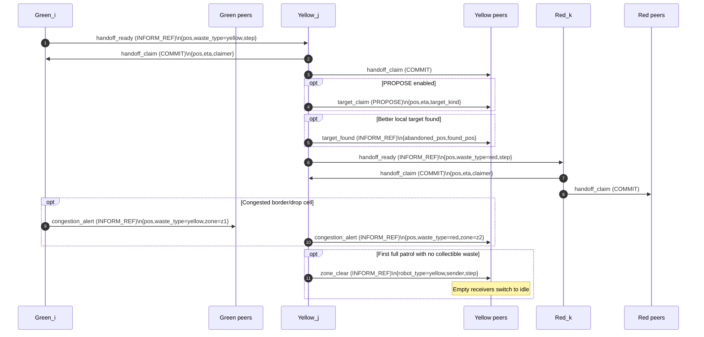

# Robot Mission MAS 2026
## Self-organization of robots in a hostile environment

- **Group number:** 22
- **Members:**
  - Gabriel Anjos Moura
  - Vinícius da Mata e Mota
  - Nicholas Oliveira Rodrigues Bragança

---

## Project Structure

| File | Description |
|---|---|
| `actions.py` | Catalog of action factories returned by `deliberate` (`move`, `pick`, `transform`, `transform_orphan`, `drop`, `dispose`, `idle`). |
| `agents.py` | Green, yellow, and red robot classes implementing the perception → deliberation → action cycle. |
| `objects.py` | Passive environment objects: `Waste`, `RadioactivityCell`, `WasteDisposalZone`. |
| `model.py` | Mesa model: environment initialization, action execution (`do`), and `DataCollector`. |
| `server.py` | Solara visualization server. |
| `run.py` | Quick headless execution in script mode. |
| `config.py` | Default parameters and visual constants. |
| `communication/` | Communication package (mailbox, message types, performatives, and dispatch service). |

---

## Environment

The grid (default **15 × 10**) is divided into three vertical zones of equal width:

| Zone | Columns | Radioactivity | Robots allowed |
|---|---|---|---|
| `z1` (green) | 0 – 4 | 0.00 – 0.33 | Green, Yellow, Red |
| `z2` (yellow) | 5 – 9 | 0.33 – 0.66 | Yellow, Red |
| `z3` (red) | 10 – 14 | 0.66 – 1.00 | Red only |

A single **Waste Disposal Zone** is placed at a random row on the rightmost column.

---

## Robot Strategy

All robots share the same **perception → deliberation → action** loop defined in `BaseRobotAgent.step_agent()`. Each step, a robot:
1. Receives **percepts** from the model (visible tiles, waste positions, allowed moves).
2. Updates its **knowledge** dictionary (includes a 25-step positional history and a persistent memory map of seen tiles).
3. Runs **`deliberate(knowledge)`** to choose an action.
4. Sends the action to the model via **`do()`** and stores the returned percepts.

### Perception and movement model

- **Limited field of view:** the robot only perceives its own cell + immediate neighbourhood (`Moore`, radius 1), filtered by allowed zones.
- **Local motion:** each move is to one neighbouring cell only (including diagonals), always avoiding occupied robot cells.
- **Target following:** movement towards a target uses Manhattan-distance minimization over free neighbouring cells.
- **Memory use:** although perception is local, robots keep a persistent map (`knowledge["memory"]`) of previously seen tiles/waste.

### Zig-zag patrol

When no actionable waste target is available, robots patrol using a precomputed `patrol_path`:
- Built once per robot from allowed zone boundaries.
- X waypoints advance with stride 3 (`min_x + 1, min_x + 4, ...`) and may append `max_x - 1`.
- For each waypoint column, Y alternates between top and bottom (`0 ↔ ymax`), creating a **zig-zag vertical sweep**.
- The path is rotated so each robot starts from the closest waypoint to its initial position.

---

### 🟢 Green Robot — `GreenRobotAgent`

**Zone:** `z1` only | **Collects:** green waste | **Produces:** yellow waste | **Capacity:** 2

#### Decision flow

1. If carrying a **yellow** item, deliver to nearest `z1` east target and `drop`.
2. If carrying one **green** and no reachable green target remains, execute `transform_orphan` (green → yellow).
3. If carrying 2 greens, execute `transform` (2 green → 1 yellow).
4. If standing on green waste and has capacity, `pick`.
5. Otherwise, move to nearest known green target.
6. If no target exists, follow zig-zag patrol (`goal_type="patrol"`).
7. Extra handoff behavior: after dropping yellow on `z1` east border and becoming empty, retreat west/random free move to avoid blocking yellow robots.

---

### 🟡 Yellow Robot — `YellowRobotAgent`

**Zones:** `z1` and `z2` | **Collects:** yellow waste | **Produces:** red waste | **Capacity:** 2

#### Decision flow

1. If carrying a **red** item, deliver to nearest `z2` east target and `drop`.
2. If carrying one **yellow** and no yellow target remains, execute `transform_orphan` (yellow → red).
3. If carrying 2 yellows, execute `transform` (2 yellow → 1 red).
4. If standing on yellow waste and has capacity, `pick`.
5. Otherwise, move to nearest known yellow target.
6. If no target exists, follow zig-zag patrol (`goal_type="patrol"`).

Yellow robots can enter `z1` to collect yellow waste produced by green robots at the `z1`/`z2` handoff.

---

### 🔴 Red Robot — `RedRobotAgent`

**Zones:** `z1`, `z2`, `z3` (all zones) | **Collects:** red waste | **No transformation** | **Capacity:** 1

#### Decision flow

1. If carrying one red item:
   - at disposal zone: `dispose`;
   - otherwise: move toward disposal position.
2. If on a red waste cell and empty, `pick`.
3. Else move to nearest known red target.
4. If no target exists, use zig-zag patrol (not random walk).

---

## Orphan Waste Handling

When the total quantity of waste of a given type is **odd**, one unit will be left without a pair and can never be transformed through the standard 2-into-1 rule. We handle this via **forced promotion** (`transform_orphan`).

### Detection

At every step, each robot distinguishes:
- **Normal waste** — `visible_waste_positions[type]`: waste items not flagged as orphan.
- **Orphan waste** — `orphan_waste_positions[type]`: waste items flagged as orphan (dropped by a previous generation of robots).

A robot decides it can handle orphan waste (`can_pick_orphans = True`) when:
- It is **already carrying 1 item** and wants to pair it, **or**
- There are **no non-orphan items left** of that type anywhere in the accessible zones — meaning no pair will ever form.

### Resolution

When a robot is carrying **exactly 1 item** of its collectible type and `target_greens` / `target_yellows` is empty (no more waste to collect), instead of dropping the lone item on the grid (where no downstream robot could handle it), it calls `transform_orphan()`:

| Situation | Action | Result |
|---|---|---|
| Green robot holds 1 green, no more greens | `transform_orphan()` | cargo becomes **yellow** |
| Yellow robot holds 1 yellow, no more yellows | `transform_orphan()` | cargo becomes **red** |

The robot then proceeds with its normal delivery step: it carries the promoted item to the east border and drops it, where the next tier of robots picks it up as a regular item.

This ensures the full pipeline never stalls: every waste unit, whether paired or not, eventually reaches the disposal zone.

### Why not `drop(orphan=True)`?

An earlier design dropped the lone item at the zone border with an `orphan` flag. This was broken because the downstream robot (e.g. yellow) only collects its own type (yellow) — a green orphan dropped at the border would sit there forever. `transform_orphan` avoids this by promoting the item in-cargo before delivery.

---

## Agent Communication Protocol

Robots communicate through the `communication/` package (`Message`, `Mailbox`, `MessageService`, `MessagePerformative`).

### Transport model

- The mission uses `instant_delivery=False`.
- At each tick, `model.step()` first calls `message_service.dispatch_messages()`, then agents execute their actions.
- Practical effect: messages sent in step `t` are consumed in step `t+1`.

### Performatives used

| Performative | Role in this project |
|---|---|
| `PROPOSE` | Non-binding target reservation announcements (`target_claim`) |
| `COMMIT` | Binding handoff reservation (`handoff_claim`) |
| `INFORM_REF` | Event notifications (`handoff_ready`, `target_found`, `congestion_alert`) |

Notes:
- The enum also contains `ACCEPT`, `ASK_WHY`, `ARGUE`, `QUERY_REF`, but they are not used in the current mission logic.
- Solara exposes `Enable PROPOSE messages` so you can disable only `PROPOSE` traffic in a run while keeping `COMMIT` and `INFORM_REF`.

### Message types

| `kind` | Performative | Sender -> Receivers | Intent | Typical payload |
|---|---|---|---|---|
| `handoff_ready` | `INFORM_REF` | Green -> all Yellow, Yellow -> all Red | Announces new transformed waste dropped on handoff border | `pos`, `waste_type`, `robot_type`, `step` |
| `handoff_claim` | `COMMIT` | Claimer -> source robot + peers of same color | Commits pickup responsibility for a handoff target | `pos`, `eta`, `claimer`, `handoff_sender`, `waste_type`, `step` |
| `target_claim` | `PROPOSE` | Robot -> peers of same color | Announces current target and ETA to reduce duplicate pursuit | `pos`, `eta`, `claimer`, `target_kind`, `waste_type`, `step` |
| `target_found` | `INFORM_REF` | Robot -> peers of same color | Announces abandonment of previous target/handoff after finding a better local pick | `abandoned_pos`, `found_pos`, `finder`, `handoff_sender`, `waste_type`, `step` |
| `congestion_alert` | `INFORM_REF` | Border producer -> peers of same color | Announces blocked border/drop cell to avoid repeated drops on the same cell | `pos`, `waste_type`, `zone`, `sender`, `step` |
| `zone_clear` | `INFORM_REF` | First robot that completes a full patrol with no waste found -> peers of same color | Announces that the color-specific zone/workload is clear; receivers stop moving when empty | `robot_type`, `sender`, `step` |

### Interaction protocol (Mermaid)



---

## Visualization of Trajectories and Goals

In `server.py`, `GridZones` renders extra robot-intent overlays from each robot's knowledge:
- **Waste memory links:** dotted line from robot to remembered waste targets (including orphans of its own collectible type).
- **Planned objective trajectory:** solid magenta line from robot to `current_goal` when goal type is an objective.
- **Patrol trajectory:** dashed blue line from robot to `current_goal` when goal type is patrol.

The sidebar has per-type toggles:
- `Green Trajectories`
- `Yellow Trajectories`
- `Red Trajectories`

---

## How to Run

### Headless simulation

```bash
conda activate project-mas-env
python run.py
```

You can also run a single custom scenario directly from CLI:

```bash
python run.py \
  --width 30 --height 20 \
  --n-green-robots 8 --n-yellow-robots 6 --n-red-robots 4 \
  --initial-green-waste 80 --initial-yellow-waste 40 --initial-red-waste 20 \
  --max-steps 1200 \
  --seed 42
```

### Interactive visualization (Solara)

```bash
conda activate project-mas-env
solara run server.py
```

### Benchmark sweep (without Solara server)

`run.py` also supports combinatorial benchmarks with repetitions:

```bash
python run.py --benchmark \
  --widths 15,30 \
  --heights 10,20 \
  --green-robots 4,8 \
  --yellow-robots 3,6 \
  --red-robots 2,4 \
  --green-waste 24,48 \
  --yellow-waste 12,24 \
  --red-waste 12,24 \
  --max-steps-grid 300,600 \
  --repetitions 3 \
  --seed-base 1000 \
  --output-dir benchmark_results
```

This command runs all parameter combinations (`Cartesian product`) and stores:
- `benchmark_metadata.json` — benchmark setup (grid values, repetitions, seeds, total planned runs).
- `benchmark_runs.csv` — one row per run with final metrics and run status.
- `benchmark_scenarios.csv` — aggregated per-scenario metrics (mean/std/min/max).
- `benchmark_timeseries.csv` — per-step metrics from `DataCollector` (unless `--skip-timeseries` is used).

Main optimization targets available in CSV output:
- `steps_executed`
- `final_remaining_waste`
- `final_efficiency`
- `final_total_distance`
- `completion_rate` (scenario-level)

### Plot benchmark results

After the benchmark, generate plots with:

```bash
python plot_benchmark.py --input-dir benchmark_results
```

Optional flags:
- `--output-dir benchmark_results/plots_custom`
- `--skip-timeseries` (faster when `benchmark_timeseries.csv` is very large)
- `--top-scenario-labels 20`

Generated images (PNG):
- `run_level_distributions.png`
- `runtime_distribution.png`
- `parameter_impact_completion.png`
- `parameter_impact_steps.png`
- `parameter_impact_efficiency.png`
- `scenario_frontier.png`
- `timeseries_summary.png` (unless `--skip-timeseries`)

---

## Default Parameters (`config.py`)

| Parameter | Default |
|---|---|
| Grid width | 15 |
| Grid height | 10 |
| Green robots | 4 |
| Yellow robots | 3 |
| Red robots | 2 |
| Initial green waste | 24 |
| Initial yellow waste | 12 |
| Initial red waste | 12 |
| Max steps | 300 |
